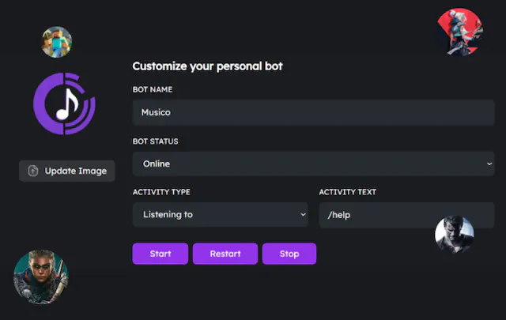
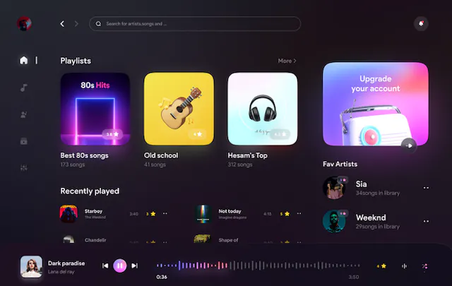
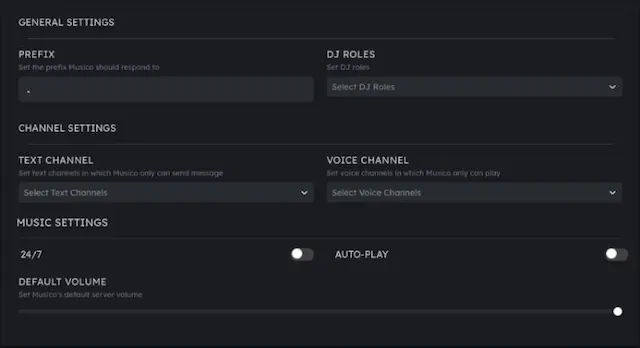

# 👋 Welcome To Musico

## Musico Bot

**Listen to your favourite music on discord with your friends! Edit the music with audio filters, custom playlists, autoplay, 24/7 and much more!**

### Why Use Musico?

Musico is one of the best discord music bot that you can find and provides free features which are paid in other bots! Let's have a look into Musico's features

## Custom Bot Creation Made Easy!

Customize your own bot like never before with the MusicoBot. Think of it as your Server's unique music bot. You're in charge, and Musico follows your lead!.

<figure><figcaption></figcaption></figure>

### WEB PLAYER

Manage the music directly from the Dashboard, get rid of duplicate tracks, decide what to skip with your friends, and more.


#### _<mark style="color:blue;">Coming soon! (Still Under Development)</mark>_


<figure><figcaption></figcaption></figure>

## Advanced Web Dashboard.

Everything you need is right at your fingertips. Set your server\&#39s prefix, configure text and voice channels, adjust default volume, and more! all without the need for manual command typing.

<figure><figcaption></figcaption></figure>

## &#x20;                           Discover, Share, and Groove.

## Quick links


[change-log.md](welcome-to-musico/change-log.md)



[musico-features.md](overview/musico-features.md)



[getting-started-with-musico](overview/getting-started-with-musico/)


## Configuring Musico&#x20;

We've put together some helpful guides for you to get setup quickly and easily.


[initial-setup](musico-and-premium+/initial-setup/)



[dj-commands.md](musico-and-premium+/initial-setup/musico-dj-role/dj-commands.md)



[musico-dj-role](musico-and-premium+/initial-setup/musico-dj-role/)

