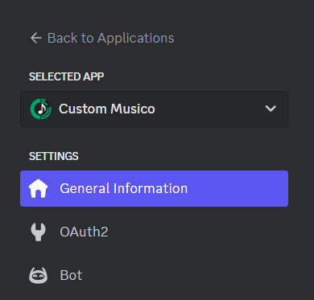
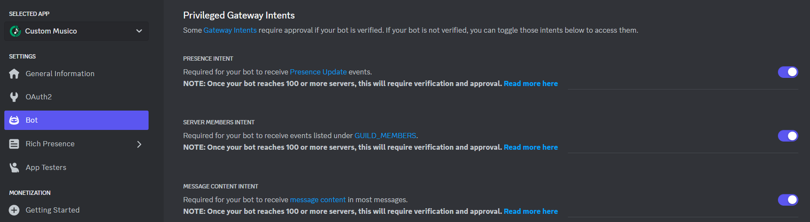

# 🛠️ Custom Bot Setup & Configuration

**Welcome to the ultimate guide for Custom Bot Setup & Configuration! Whether you're new to the world of Discord bots or a seasoned enthusiast, this guide is crafted to assist you through every phase of bot creation and customization. We aim to provide a seamless journey from the initial setup of your Discord Application to personalizing your bot with a unique Profile Avatar and Handle. Let's dive in and bring your bot to life!**

## Custom Bot Setup


**You will need to open your** [<mark style="color:purple;">**Discord Developer Account**</mark>](https://discord.com/developers/applications)


<div data-full-width="false">

<figure><figcaption></figcaption></figure>

</div>



#### <mark style="color:orange;">#1 Create Your App</mark>

First, you'll need to create an App in the [<mark style="color:purple;">**Discord Developer Porta**</mark><mark style="color:purple;">l</mark>](https://discord.com/developers/applications) if you don't have one already:

[_<mark style="color:purple;">**Create Your Discord Bot App**</mark>_](https://discord.com/developers/applications?new\_application=true)

Enter a name for your app, then press Create.

<figure><figcaption><p>Click Create When Ready To Continue</p></figcaption></figure>

**After you create your app, you'll land on the General Overview page**

<figure><figcaption></figcaption></figure>

This is where you can update basic information about your app, like its description and icon. You'll also see an _<mark style="color:orange;">**Application ID**</mark>_**.**

<figure><figcaption><p><strong>This is the developers Name and Icon Settings not what is reflected in your Discord Server. See</strong> <a href="custom-bot-setup-and-configuration.md#bot-section"><strong>Bot Section</strong></a></p></figcaption></figure>


#### Copy the _<mark style="color:orange;">Application ID</mark>_ to a notepad or Take note of its location. You will need it to paste in your _Customs Musico Dashboard_ later on.


***

#### <mark style="color:orange;">#2 Bot Section</mark>

As you can see this is where you can set the _<mark style="color:green;">**"Username"**</mark>_ and Choose your Custom Bots _<mark style="color:green;">**"Icon" (Avatar)**</mark>_

<figure><figcaption><p><strong>The Username and Avatar (Icon) chosen here will reflect what it will look like in your Discord Server</strong></p></figcaption></figure>

#### A) Get your _<mark style="color:orange;">Bot Token</mark>_

You will see the "_<mark style="color:orange;">**Reset Token**</mark>_" button, **click it** and **copy the token down in your notepad**, we will need that in the **Customs Musico Dashboard** later on.

#### B) Setting up [<mark style="color:green;">Privileged Gateway Intents</mark>](https://app.gitbook.com/s/nos3gD9Mtz0kmmiQGyLs/this-week/february)

You have to enable settings like its [privileged intents](#user-content-fn-1)[^1] in order for your bot to work correctly. See below for an example:

<figure><figcaption><p>Please make sure ALL 3 are selected to Enabled</p></figcaption></figure>

<mark style="color:orange;">PRESENCE INTENT</mark>

Required for your bot to receive [Presence Update](https://discord.com/developers/docs/topics/gateway#presence-update) events.

**NOTE: Once your bot reaches 100 or more servers, this will require verification and approval.** [**Read more here**](https://support.discord.com/hc/en-us/articles/360040720412)

<mark style="color:orange;">SERVER MEMBERS INTENT</mark>

Required for your bot to receive events listed under [GUILD\_MEMBERS](https://discord.com/developers/docs/topics/gateway#list-of-intents).

**NOTE: Once your bot reaches 100 or more servers, this will require verification and approval.** [**Read more here**](https://support.discord.com/hc/en-us/articles/360040720412)

<mark style="color:orange;">MESSAGE CONTENT INTENT</mark>

Required for your bot to receive [message content](https://support-dev.discord.com/hc/en-us/articles/4404772028055) in most messages.

**NOTE: Once your bot reaches 100 or more servers, this will require verification and approval.** [**Read more here**](https://support.discord.com/hc/en-us/articles/360040720412)

#### <mark style="color:orange;">#3 OAuth2 (</mark><mark style="color:green;">Add bot to your server</mark><mark style="color:orange;">)</mark>

Click on <mark style="color:orange;">**OAuth2**</mark> in the left sidebar, then select <mark style="color:orange;">**Bot**</mark> Under the <mark style="color:green;">**URL generator**</mark>.

<figure><figcaption><p>First Select Bot</p></figcaption></figure>

After you select <mark style="color:orange;">**`Bot`**</mark>, you may also select different permissions for your bot. For now let us just check <mark style="color:orange;">**Administrator**</mark>. This will _generate the link at the bottom_ used to Invite your bot to your Discord Server!

<mark style="color:red;">**Example of Selections Required to Generate Link:**</mark>

<figure><figcaption></figcaption></figure>

Copy and paste into your browser to invite your Music Bot to your Discord Server, Please Continue to the [Custom Musico Dashboard](custom-bot-setup-and-configuration.md#musico-dashboard-setup-and-configuration) to finish Setup.



```
// Will Enter in the the instructions with Images Once I have access to the dashboard!
```



### [<mark style="color:yellow;background-color:yellow;">Custom Musico Dashboard Setup and Configuration</mark>](https://customs.musicobot.xyz/dashboard)

<figure><figcaption><p>Initial Dashboard Page</p></figcaption></figure>

### [<mark style="color:yellow;">Bot Tab</mark>](https://customs.musicobot.xyz/)

_**Under the**** **<mark style="color:orange;">**Bot**</mark>** ****Section in the Dashboard there are some very simple settings for you to configure -**** **<mark style="color:orange;">**see below**</mark>**;**_

<mark style="color:orange;">**Outlined in Orange:**</mark> <mark style="color:orange;">**Here you customize your Bot**</mark> <mark style="color:orange;">**Image/Icon/Avatar**</mark> <mark style="color:orange;">**and its**</mark> _<mark style="color:orange;">**Usernam**</mark>_<mark style="color:orange;">**e**</mark>

<mark style="color:green;">**Outlined in Green:**</mark> <mark style="color:green;">**Is the Activity and Text it displays in your server**</mark>

<mark style="color:red;">**Outlined in Red: Change the Status of the Bot to**</mark> <mark style="color:red;">**Offline or Online**</mark>

<figure><figcaption><p>Bot Section Explained</p></figcaption></figure>

<mark style="color:blue;">**Outlined In Blue: You can Select the Servers that will be activated under your Subscription**</mark>

### [<mark style="color:yellow;">Custom Musico Settings Tab</mark>](https://customs.musicobot.xyz/dashboard)


### Click <mark style="color:purple;">Dashboard</mark> button on your server to access settings




<figure><figcaption><p>Example Setup</p></figcaption></figure>

**In this section you will be able to select **<mark style="color:orange;">**DJ Roles**</mark>**. Set Voice & Text Channels to where the Music Bot is allowed to function.**



[^1]: Some intents are defined as "privileged" due to the sensitive nature of the data. Currently, those intents include:

    * `GUILD_PRESENCES`
    * `GUILD_MEMBERS`
    * [`MESSAGE_CONTENT`](https://discord.com/developers/docs/topics/gateway#message-content-intent)

    Apps that qualify for verification must be approved for the privileged intent(s) before they can use them.

    intents within the app's settings within the Developer Portal.

    Before you specify privileged intents in your `IDENTIFY` payload, you must enable the privileged intents your app requires. [Verified apps](https://support.discord.com/hc/en-us/articles/360040720412-Bot-Verification-and-Data-Whitelisting) can only use privileged intents after they've been approved for them.
